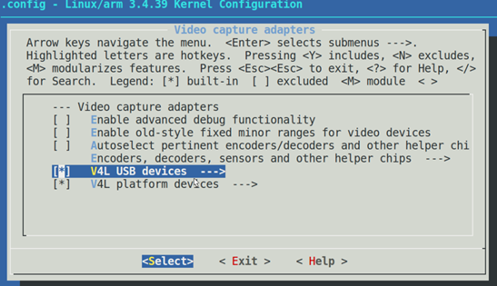
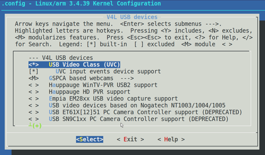
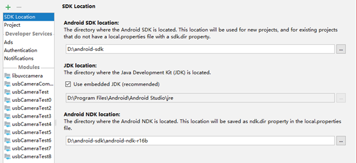
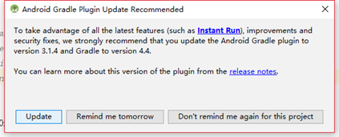
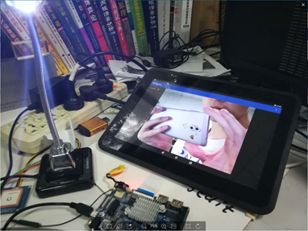
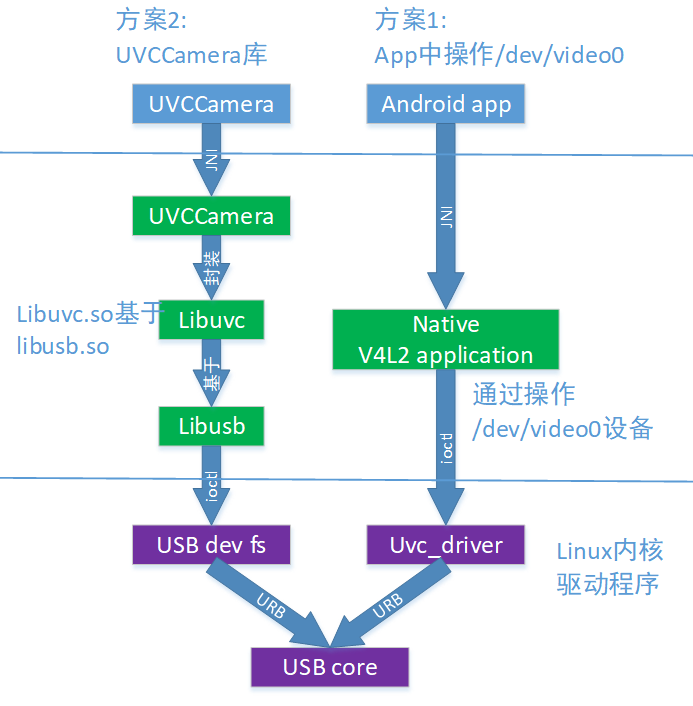

# android usb camera


## 1.UVC协议

UVC，全称为：USB video class 或USB video device class。是Microsoft与另外几家设备厂商联合推出的为USB视频捕获设备定义的协议标准，目前已成为USB org标准之一。
在Linux以及基于Linux内核的系统上驱动USB摄像头需要首先确认摄像头设备支持UVC协议。
UVC协议规范见: https://www.usb.org/documents

查看USB摄像头是否支持UVC协议：
* 1．连接USB摄像头到ubuntu PC机，使用dmesg命令查看Linux内核USB设备枚举日志，在里面找到UVC字样说明USB摄像头设备支持UVC协议。
* 2．使用如下命令查看USB摄像头设备挂载点
	ls /dev/video*
一般情况下摄像头设备都会被挂在到/dev/video0节点。
* 3．使用工具xawtv对/dev/video0文件进行查看，如果能够显示图像，说明使用UVC协议驱动摄像头的方案是可行的。
xawtv /dev/video0

参考：https://blog.csdn.net/qq_26093511/article/details/78763824

## 2.方案1：操作/dev/video0

### 2.1 修改Linux内核

当接入USB摄像头时如果产生/dev/video0设备文件，说明系统自带UVC协议支持。
但是，大部分Android设备的内核并不支持UVC协议。这就需要我们重新编译Linux内核来添加对UVC协议的支持。

#### Step1 : 修改驱动程序
在drivers/media/video/uvc/uvc_driver.c的uvd_ids中增加如下就行。

``` c
{ .match_flags      = USB_DEVICE_ID_MATCH_DEVICE  
       | USB_DEVICE_ID_MATCH_INT_INFO,  
.idVendor     = 0x1908,  
.idProduct        = 0x2310,  
.bInterfaceClass  = USB_CLASS_VIDEO,  
.bInterfaceSubClass   = 1,  
.bInterfaceProtocol   = 0,  
.driver_info      = UVC_QUIRK_FIX_BANDWIDTH },
```
#### Step2 : 添加编译选项
在Linux内核源码目录：
make menuconfig
然后加入下面的几项。
```
Device Drivers --->
     <*>Multimedia support --->
		<*> Video capture adapters --->
```

```
Device Drivers --->
     <*>Multimedia support --->
		<*> Video capture adapters --->
			<*> V4L USB devices --->
```


保存并退出。此时，.config文件中以下配置项均应该为y
``` config
CONFIG_VIDEO_DEV=y
CONFIG_VIDEO_V4L2_COMMON=y
CONFIG_VIDEO_MEDIA=y
CONFIG_USB_VIDEO_CLASS=y
CONFIG_V4L_USB_DRIVERS=y
CONFIG_USB_VIDEO_CLASS_INPUT_EVDEV=y
```

重新编译并烧写内核后。插入USB摄像头，查看/dev/video0设备文件是否产生。

成功生成/dev/video0设备后，就可以在Android APP中通过读写/dev/video0设备来操作USB摄像头了。
但是需要注意的是，如果开发板未获取到root权限可能导致/dev/video0设备无法访问，使用adb命令将/dev/video0设备的访问权限设置为666即可。
进入adb shell，然后输入如下命令
	su
	chmod 666 /dev/video0
也可将/ueventd.xxxx.rc中的/dev/video0的权限设置 为 0666

### 2.2 V4L2编程
有了/dev/video0设备文件之后，我们应用程序需要通过V4L2接口来和/dev/video0设备进行交互。

v4l2为linux下视频设备程序提供了一套接口规范。包括一套数据结构和底层V4L2驱动接口。只能在linux下使用。它使程序有发现设备和操作设备的能力。它主要是用一系列的回调函数来实现这些功能。像设置摄像头的频率、帧频、视频压缩格式和图像参数等等。当然也可以用于其他多媒体的开发，如音频等。
在Linux下，所有外设都被看成一种特殊的文件，成为“设备文件”，可以象访问普通文件一样对其进行读写。一般来说，采用V4L2驱动的摄像头设备文是/dev/video0。为了通用，可以建立一个到/dev/video0的链接。V4L2支持两种方式来采集图像：内存映射方式(mmap)和直接读取方式(read)。V4L2在include/linux/videodev.h文件中定义了一些重要的数据结构，在采集图像的过程中，就是通过对这些数据的操作来获得最终的图像数据。Linux系统V4L2的能力可在Linux内核编译阶段配置，默认情况下都有此开发接口。V4L2从Linux 2.5.x版本的内核中开始出现。

V4L2规范中不仅定义了通用API元素(Common API Elements)，图像的格式(Image Formats)，输入/输出方法(Input/Output)，还定义了Linux内核驱动处理视频信息的一系列接口(Interfaces)，这些接口主要有：
* 视频采集接口——Video Capture Interface;
* 视频输出接口—— Video Output Interface;
* 视频覆盖/预览接口——Video Overlay Interface;
* 视频输出覆盖接口——Video Output Overlay Interface;
* 编解码接口——Codec Interface。会3

在Linux系统中简单的C语言应用程序即可与/dev/video0通信，但是在Android系统中，

Android app的编写可以参考如下例程：
https://github.com/noritsuna/UVCCameraSampleForAndroid

### 2.3问题整理
问题1
现象：重新烧写内核导致USB HOST无法使用，
使用的内核镜像uImage组件和平台不对应就会出现这种问题。为了保证不受之前编译的影响，则重新从github下载内核重新编译即可

### 参考文献：

驱动移植：
linux下USB摄像头的使用说明 https://blog.csdn.net/flfihpv259/article/details/52367805
linux USB 摄像头 驱动 移植，使用 https://blog.csdn.net/woshidahuaidan2011/article/details/52055057
https://blog.csdn.net/codectq/article/details/44278465
详解V4L2框架(UVC驱动) https://blog.csdn.net/Guet_Kite/article/details/78570059

V4L2应用开发
Video4linux详解 https://blog.csdn.net/tiankongtiankong01/article/details/53353876
V4l2 demo https://blog.csdn.net/u010164190/article/details/53189836
V4L2 ioctl接口 https://blog.csdn.net/g_salamander/article/details/8107692

## 3.方案2：使用开源的UVCCamera库

开源的UVCCamera库是一个基于Android系统的USB摄像头API函数库。详细介绍请参考官方GitHub：
https://github.com/saki4510t/UVCCamera
以及国人利用UVCCamera库进行二次开发的demo：
https://github.com/jiangdongguo/AndroidUSBCamera

### 3.1方案特点：

UVCCamera库工作在Android framework层，所以不需要Linux内核支持UVC协议，只需要支持USB HOST驱动即可操作USB摄像头。
这种方案的优点是：
	不需要修改Linux内核
	不需要root权限
缺点：
不容易移植，需要手动安装NDK和gradle
编译过程可能发生各种BUG

### 3.2使用方法：

第一步 添加JitPack仓库到工程gradle
```
allprojects {
	repositories {
	...
	maven { url 'http://raw.github.com/saki4510t/libcommon/master/repository/' }
	maven { url 'https://jitpack.io' }
	}
}
```
第二步 添加依赖到app Module的gradle
```
dependencies {
compile 'com.github.jiangdongguo:AndroidUSBCamera:2.2.8'
}
```
参考：UVCCamera开发通用库 https://blog.csdn.net/andrexpert/article/details/78324181

### 3.3错误集锦：

#### 错误1
NDK编译出错解决办法。直接移植例程可能会出现下述问题：
	Ndk-build.cmd返回非零数字2
	No toolchains found in the NDK toolchains folder for ABI with prefix: mips64el-linux-android
使用Android SDK组件中安装的NDK会导致编译各种错误。需要下载单独的NDK。在官网上下载最新版本安装即可。
下载地址：https://developer.android.google.cn/ndk/downloads/


在Android studio中file  project structure。选择解压后NDK的路径，然后重新编译程序。

#### 错误2
问题：
Failed to resolve: common
使用Android studio自带的gradle往往都会出现这个问题。从GitHub下载demo工程的gradle版本都是3.3，如果根据Android studio的提示将gradle升级到最新版本就会出现程序无法找到common的错误。
如果使用Android studio自带gradle进行编译就不能升级新版本gradle。但是经过我的尝试，手动指定新版本的gradle不会引起编译出错。
首先需要下载gradle。到官网下载适合版本的gradle: https://gradle.org/releases/ (经过我测试的版本是4.5)
并在settings gradle中指定下载的gradle路径


注意:当Android studio弹出下面窗口提示更新gradle时，千万不要点update。可以点击最右面的按钮，永不更新！！！


#### 错误3
问题：
在UVCCamera例程中点击打开摄像头设备后程序闪退。
这是因为某种原因导致我们编译的NDK有问题。
1使用编译好的SO库替代NDK编译的SO库
2将libuvccamera目标中build.gradle的如下几行注释掉。阻止NDK编译覆盖我们的SO库。

如果突然出现程序内大量包找不到(宏观表现就是程序满江红全是未定义的变量)，使用下述方法解决
解决方案：菜单栏file->invalidate caches/restart -> invalidate and restart

### 3.4 结果展示

效果如下图所示：



### 3.5 参考文献

参考文档：
UVCCamera开发通用库 https://blog.csdn.net/andrexpert/article/details/78324181
UVCCamera安卓驱动USB摄像头 https://blog.csdn.net/king_jie0210/article/details/71106720
UVCCamera使用 https://blog.csdn.net/fengshiguang2012/article/details/79569280
Linux USB 摄像头驱动 https://blog.csdn.net/qq_26093511/article/details/78763824
UVC驱动外接摄像头 https://blog.csdn.net/luzhenyuxfcy/article/details/50883910

参考例程：
https://github.com/jiangdongguo/AndroidUSBCamera
https://github.com/saki4510t/UVCCamera


其他
Android.mk转cmake https://blog.csdn.net/u012528526/article/details/80647537

## 4 源码萃取
本章分析两种方案分别对应的底层架构和源码。单纯使用方案则不需要阅读本章


### 4.1 方案底层架构
#### 方案1:
Java层只提供基本界面，实际工作都是在Android Framework层进行处理。方案1APP的Framework层实质上就是一个V4L2应用程序。
在初始化函数中打开/dev/video0设备并通过ioctl系统调用与uvc_driver驱动程序进行交互。交互的方式遵循V4L2接口规范。
uvc_driver将用户的ioctl系统调用转化成URB数据结构发送到USB core，也就是Linux系统USB核心。USB核心对系统中所有的USB请求进行调度最终实现驱动摄像头的目的

#### 方案2：
Java app层使用android.hardware.usb包进行USB连接的管理。发现并处理USB设备接入广播。并在回调函数中对USB连接进行处理。
用户在回调函数中调用UVCMonitor提供的API函数，这些API函数都会经过UVCMonitor转发到Framework层的UVCCamera模块。
Framework层的UVCCamera模块提供了对libuvc库的封装。所有对USB摄像头的操作最终调用的都是libuvc的库函数。
Libuvc库是的运行需要基于开源的USB通信库libusb。可以理解为libuvc和libusb是根据协议栈进行层层封装的关系。
运行与Framework层的libusb若想驱动USB接口，最终也需要和linux内核进行通信，这个通信是基于USB设备文件系统进行的。
USB设备文件系统和uvc_driver一样，也属于Linux内核USB驱动程序。由它发起的USB传输事务最终也需要封装成URB的形式交由usb core进行处理。


