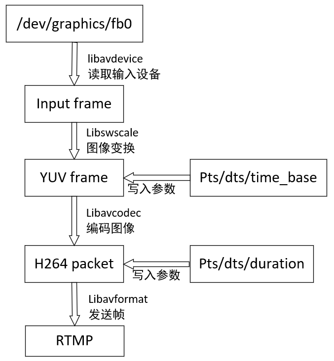
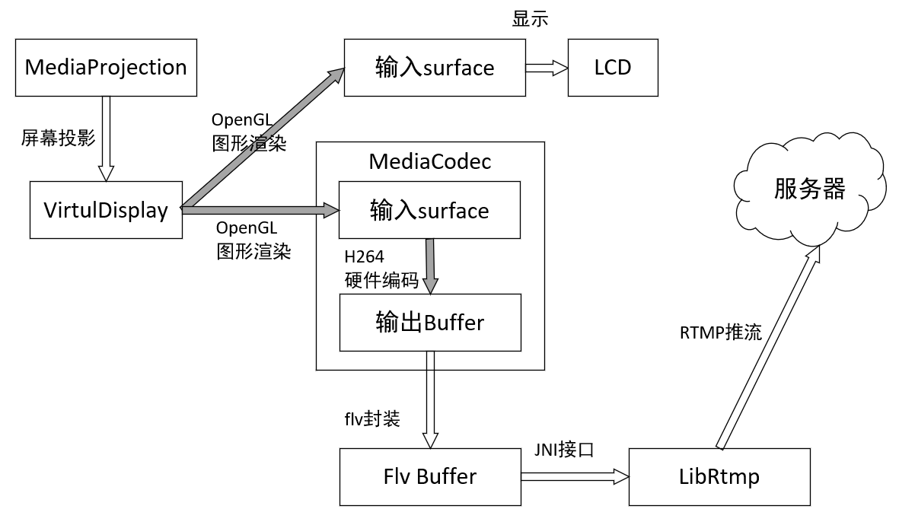
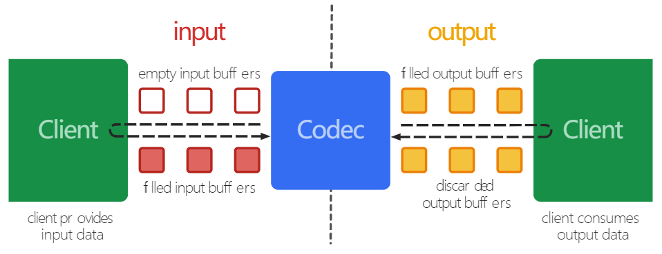
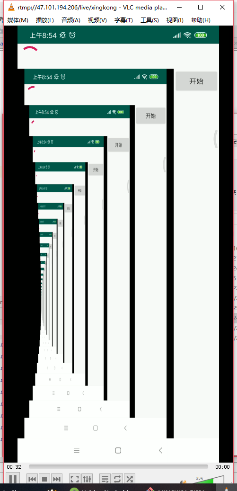
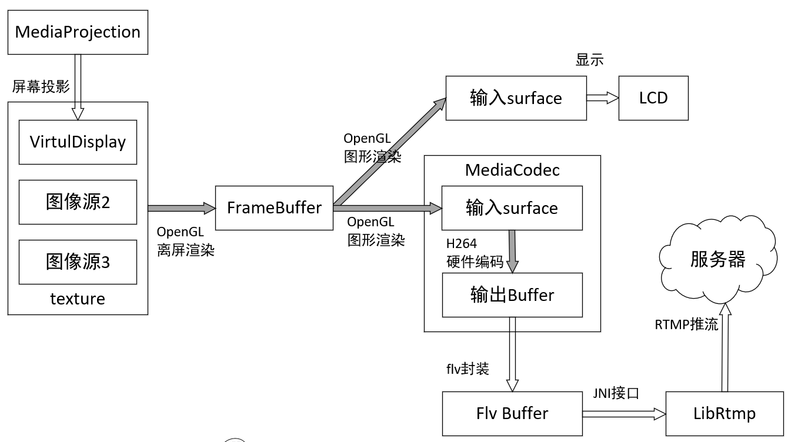

# android端RTMP推流方案

版本|日期|作者
--|--|--
1.0  |   |周星宇  

# 方案1: 基于ffmpeg的软件编码


## 0.方案概述
基于ffmpeg的软件视频编码需要获取/dev/graphics/fb0设备的访问权限，所以需要app拥有root权限。



## 1.输入设备

输入设备使用Linux内核图形缓冲区FrameBuffer

``` c
AVInputFormat *ifmt = av_find_input_format("fbdev");
if (avformat_open_input(&pInputFormatContext, "/dev/graphics/fb0", ifmt, &options) != 0) {
	loge("Couldn't open input stream.\n");
	return -1;
}
```

## 2.编码器配置

配置H264编码器的各种参数

``` c
/*创建AVCodecContext*/
pOutputCodecContex = avcodec_alloc_context3(pOutputCodec);
//编码器的ID号，这里为264编码器，可以根据video_st里的codecID 参数赋值
pOutputCodecContex->codec_id = pOutputCodec->id;
//像素的格式，也就是说采用什么样的色彩空间来表明一个像素点
pOutputCodecContex->pix_fmt = AV_PIX_FMT_YUV420P;
//编码器编码的数据类型
pOutputCodecContex->codec_type = AVMEDIA_TYPE_VIDEO;
//编码目标的视频帧大小，以像素为单位
pOutputCodecContex->width = OUTPUT_WIDTH;
pOutputCodecContex->height = OUTPUT_HEIGHT;
pOutputCodecContex->framerate = frametate;
//帧率的基本单位，我们用分数来表示，
pOutputCodecContex->time_base = time_base;
//目标的码率，即采样的码率；显然，采样码率越大，视频大小越大
pOutputCodecContex->bit_rate = 500000;
//固定允许的码率误差，数值越大，视频越小
//    pCodecCtx->bit_rate_tolerance = 4000000;
pOutputCodecContex->gop_size = 50;

pOutputCodecContex->qcompress = 0.6;
//最大和最小量化系数
pOutputCodecContex->qmin = 10;
pOutputCodecContex->qmax = 51;
//Optional Param
//两个非B帧之间允许出现多少个B帧数
//设置0表示不使用B帧
//b 帧越多，图片越小
pOutputCodecContex->max_b_frames = 0;
```


# 方案2:基于MediaCodec+librtmp的硬编码


## 0.方案概述





## 1.VirtualDisplay录屏

参考google官方MediaProjection的例程

https://github.com/googlesamples/android-ScreenCapture


## 2.MediaCodec硬编码

从广义上讲，一个编解码器处理输入数据以生成输出数据。 它异步地处理数据，并使用一组输入和输出缓冲器。 从一个简单的层面上看，可请求（或接收）一个空的输入缓冲器，然后用数据填满它，并将其发送到编解码器去处理。 编解码器使用这些数据并转换这些数据到它某个空的输出缓冲区。 最后，您请求（或接收）一个已填充数据的输出缓冲区，消耗其内容并将其释放回并回到编解码器。



### 2.1 初始化MediaCodec

``` java
MediaFormat videoFormat = MediaFormat.createVideoFormat("video/avc", param.width, param.height);
videoFormat.setInteger(MediaFormat.KEY_COLOR_FORMAT, MediaCodecInfo.CodecCapabilities.COLOR_FormatSurface);
videoFormat.setInteger(MediaFormat.KEY_BIT_RATE, param.bitRate);
videoFormat.setInteger(MediaFormat.KEY_FRAME_RATE, param.frameRate);
videoFormat.setInteger(MediaFormat.KEY_I_FRAME_INTERVAL, param.iFrameInterval);
videoFormat.setInteger(MediaFormat.KEY_PROFILE, MediaCodecInfo.CodecProfileLevel.AVCProfileBaseline);
videoFormat.setInteger(MediaFormat.KEY_LEVEL, MediaCodecInfo.CodecProfileLevel.AVCLevel31);
videoFormat.setInteger(MediaFormat.KEY_BITRATE_MODE, MediaCodecInfo.EncoderCapabilities.BITRATE_MODE_CBR);
MediaCodec res=null;
try {
    MediaCodecInfo mediaCodecInfo = selectCodec("video/avc");
    res = MediaCodec.createByCodecName(mediaCodecInfo.getName());
    res.configure(videoFormat, null, null, MediaCodec.CONFIGURE_FLAG_ENCODE);
} catch (IOException e) {
    Log.e("xingkong", e.toString());
    return null;
}
```

### 2.2 编码器回调

``` java
public class MediaCallback extends MediaCodec.Callback {

    @Override
    public void onInputBufferAvailable(MediaCodec codec, int index) {
    }

    @Override
    public void onOutputBufferAvailable(MediaCodec codec, int index, MediaCodec.BufferInfo info) {
        Log.d("xingkong", "一帧编码完成");
        if (index < 0) {
            info.set(0, 0, 0, 0);
            mCachedInfos.offer(info);
            return;
        }
        ByteBuffer encodedData = codec.getOutputBuffer(index);
        mFlvPacker.onVideoData(encodedData, info);
        codec.releaseOutputBuffer(index, true);
    }

    @Override
    public void onError(MediaCodec codec, MediaCodec.CodecException e) {
    }

    @Override
    public void onOutputFormatChanged(MediaCodec codec, MediaFormat format) {
    }
}

```


## 3.录屏帧率控制

给出一个思路：当有数据将要更新时，系统调用onFrameAvailable()，我们手动调用updateTexImage()向Surface(SuraceTexture)更新数据，通过GLES向Surface(MediaCodec)更新数据，在GLES处理过程中即可实现对某一帧数据的抛弃保留等。


注意，在android图形缓冲区中进行纹理采样需要使用samplerExternalOES采样器

``` GLSL
#extension GL_OES_EGL_image_external : require
precision highp float;
varying highp vec2 vTextureCoord;
uniform samplerExternalOES uTexture;
void main(){
    vec4  color = texture2D(uTexture, vTextureCoord);
    gl_FragColor = color;
}
```

## 4.效果

播放器展示的效果如图所示



## 5.扩展

扩展后的框架适合以下几种需求
1. 多个图像源进行融合(摄像头和录屏融合)
2. 图像需要经过预处理(磨皮、美颜)

这种情况可以上使用一个FrameBuffer作为缓冲区进行离屏渲染，同时进行图像的预处理


## 6.遇到问题总结

### MediaCodec问题

1.最常见问题：部分机型MediaCodec.configure直接crash

这是最常见的问题，有机型一调用这个api就直接crash，贼尴尬。这个api的第一个参数是MediaFormat，我们翻到MediaFormat的初始化源码。最后两个参数就是视频流的预设宽高，如果这个值高于当前手机支持的解码最大分辨率（后文称max），那么在调用MediaCodec.configure的时候就会crash。把MediaFormat.createVideoFormat时候的宽高设置小一点就ok了。

那么就会有另外一个问题，就是如果我设置1080*720的后，视频流来了一个1920*1080的会不会有影响？如果当前设备的max高于这个值，就算预设值不一样，也还是可以正常解码并显示1290*1080的画面。那么如果低于这个值呢？两种情况 绿屏／MediaCodec.dequeueInputBuffer的值一直抛IllegalStateException

4.部分机型MediaCodec.dequeueInputBuffer 一直IllegalStateException

我们上面解码的时候有这么一行：mMediaCodec.dequeueInputBuffer(0）
我们写入的参数long timeoutUs是0，其实是不对的，需要填入一个时间戳，可以直接写当前系统时间。因为部分机型需要这个时间戳来进行计算，不然就会一直小于0。

5.部分机型MediaCodec.dequeueOutputBuffer报IllegalStateException之后MediaCodec.dequeueInputBuffer一直报IllegalStateException（timeoutUs参数已填入系统时间）

该机型硬解码最大配置分辨率低于当前视频流的分辨率

6.部分机型卡死在MediaCodec.dequeueOutputBuffer
后面的timeoutUs参数不能跟dequeueInputBuffer的timeoutUs参数一样，写0即可

7.部分机型卡死在切换分辨率后卡死在MediaCodec.dequeueInputBuffer
目前有一些视频流在切到高分辨率后，解码线程会直接卡死在MediaCodec.dequeueInputBuffer这个api，目前没有更好的解决办法，只能在获取到设备在切分辨率后，重新开始解码

### OpenGL问题

参考:
+ https://blog.csdn.net/u012521570/article/details/78783294


## 7.参考
参考:
+ https://www.jianshu.com/nb/17697147
+ MediaCodec官方文档译文 https://github.com/eterrao/ScreenRecorder.git

帧率控制参考:
+ 屏幕录制（二）——帧率控制:https://www.jianshu.com/p/b61ea6783b07
+ https://blog.csdn.net/u010949962/article/details/41865777
